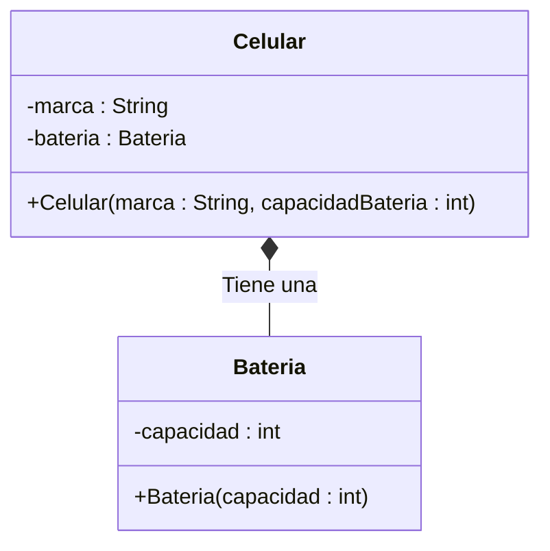

# Ejercicio 1: Modelado de Composición (Relación Fuerte)

## 📝 Descripción
Se requiere modelar un sistema para un `Celular`. Un `Celular` tiene un atributo privado `marca` (String). El sistema debe representar la relación de **composición** con su `Bateria`. 

La clase `Bateria` tiene un atributo privado `capacidad` (int). Al crear el objeto `Celular`, se debe crear automáticamente el objeto `Bateria`. Si el `Celular` se destruye, la `Bateria` también debe dejar de existir, ya que es una parte integral y dependiente.

> **Contexto Académico**: Este ejercicio refuerza el concepto de composición en UML (diamante relleno), que representa una relación de "todo-parte" donde las partes dependen existencialmente del todo.

## 🎯 Objetivos de Aprendizaje
- Modelado de la relación de composición (diamante relleno).
- Implementación de la gestión de ciclo de vida en Java (creación en constructor).
- Entendimiento de la diferencia entre composición y agregación.

## 📊 Diagrama UML (Mermaid)

---
🕓 **Dificultad**: Difícil
📚 **Temas**: Composición, Ciclo de vida de objetos.
