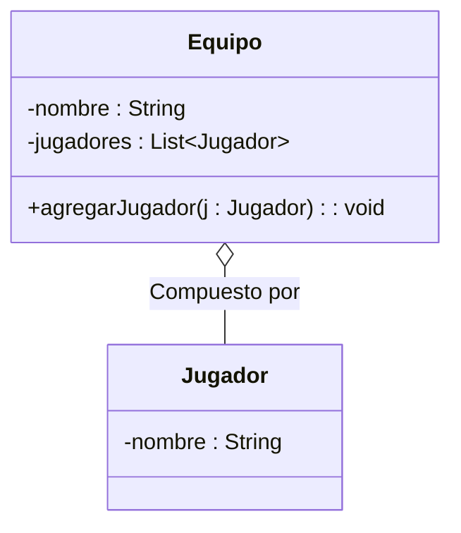

# Ejercicio 2: Modelado de Agregación (Relación Débil)

## 📝 Descripción
Se requiere modelar un sistema para un `Equipo` de fútbol. Un `Equipo` tiene un atributo privado `nombre` (String). El sistema debe representar la relación de **agregación** con sus `Jugadores`.

La clase `Jugador` tiene el atributo privado `nombre` (String). En este modelo, los jugadores pueden existir sin pertenecer a un equipo (agentes libres). Por lo tanto, el `Equipo` recibe los objetos `Jugador` creados externamente. Si el `Equipo` se disuelve, los objetos `Jugador` deben seguir existiendo en el sistema.

> **Contexto Académico**: Este ejercicio refuerza el concepto de agregación en UML (diamante hueco), que representa una relación de "todo-parte" donde las partes pueden existir independientemente del todo.

## 🎯 Objetivos de Aprendizaje
- Modelado de la relación de agregación (diamante hueco).
- Implementación de la agregación mediante parámetros de métodos o constructor.
- Entendimiento del desacoplamiento existencial entre el todo y las partes.

## 📊 Diagrama UML (Mermaid)

---
🕓 **Dificultad**: Difícil
📚 **Temas**: Agregación, Ciclo de vida independiente.
