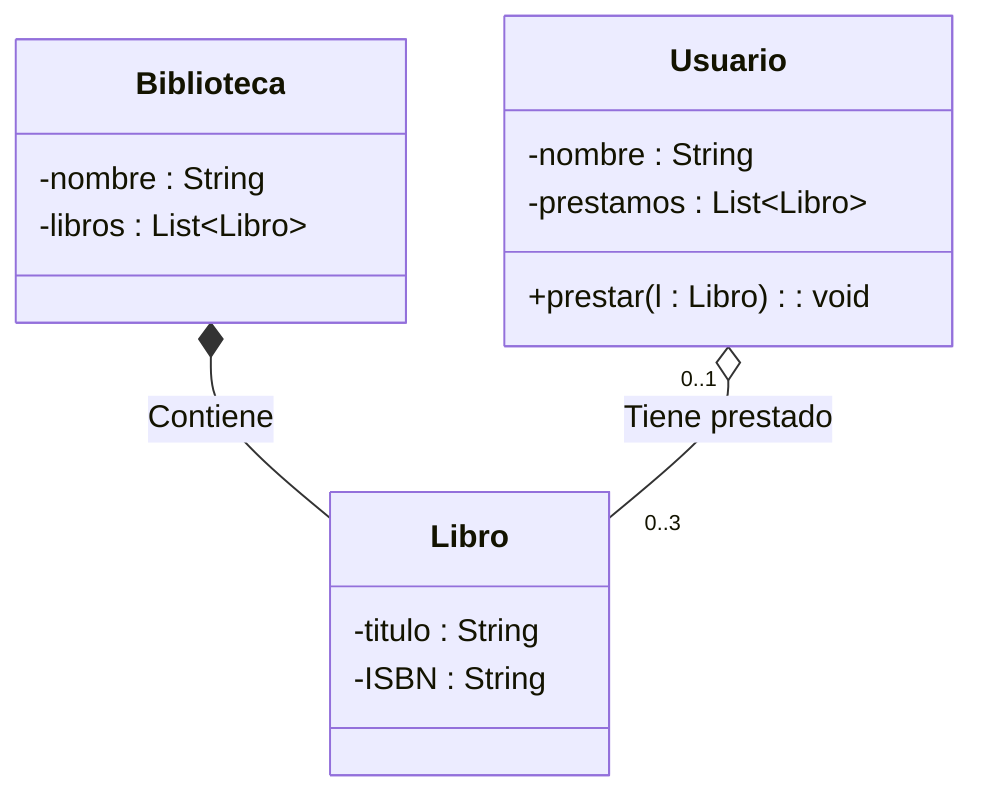

# Ejercicio 3: Modelado de Sistema de Biblioteca (Complejidad Estructural)

## 📝 Descripción
Se requiere modelar un sistema de biblioteca con las siguientes características:
1. Una `Biblioteca` tiene un atributo privado `nombre` (String).
2. Una `Biblioteca` contiene muchos `Libros` (composición).
3. Cada `Libro` tiene los atributos privados `titulo` (String) e `ISBN` (String).
4. Un `Libro` puede ser prestado por un `Usuario`.
5. Un `Usuario` tiene el atributo privado `nombre` (String).
6. Representa la asociación donde un `Usuario` puede tener **0 a 3** `Libros` prestados simultáneamente.

> **Contexto Académico**: Este ejercicio es un reto de modelado que combina múltiples tipos de relaciones (composición y asociación con multiplicidad restringida). Es el nivel máximo de detalle antes del ejercicio integrador.

## 🎯 Objetivos de Aprendizaje
- Integración de múltiples tipos de relaciones en un solo diagrama.
- Definición de multiplicidades restringidas (ej. 0..3).
- Modelado de flujos de objetos entre entidades.

## 📊 Diagrama UML (Mermaid)

---
🕓 **Dificultad**: Difícil
📚 **Temas**: Composición, Agregación, Multiplicidad Restringida.
