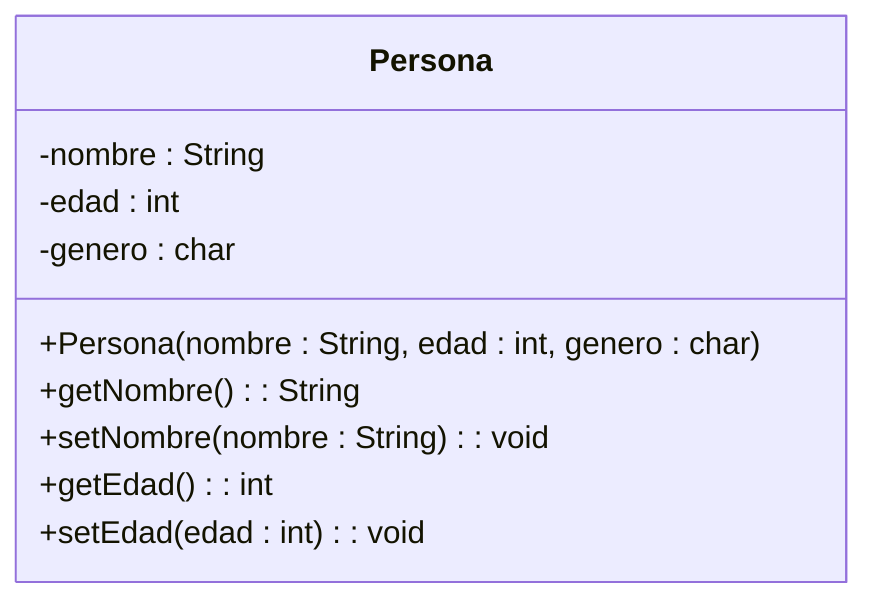

# Ejercicio 1: Clase Persona (Modelado Básico)

## 📝 Descripción
Se requiere modelar una clase `Persona` que represente a un individuo en un sistema básico. La clase debe contener los atributos privados `nombre` (String), `edad` (int) y `genero` (char). Además, debe tener un constructor público para inicializar estos valores y métodos públicos para obtener (`getters`) y establecer (`setters`) el nombre y la edad.

> **Contexto Académico**: Este ejercicio es la base para entender la representación de clases en UML, la visibilidad de los miembros y la correspondencia con el código Java.

## 🎯 Objetivos de Aprendizaje
- Representación de una clase en tres compartimentos.
- Uso de la notación de visibilidad (`+` para público, `-` para privado).
- Definición de tipos de datos en UML (`nombre : tipo`).
- Traducción de diagramas a código Java básico.

## 📊 Diagrama UML (Mermaid)

---
🕓 **Dificultad**: Fácil
📚 **Temas**: Clase, Atributos, Métodos, Visibilidad.
