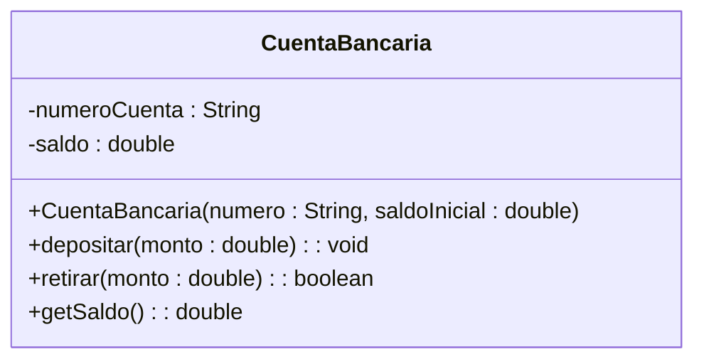

# Ejercicio 2: Clase CuentaBancaria (Modelado de Comportamiento)

## 📝 Descripción
Se requiere modelar una clase `CuentaBancaria` para gestionar el dinero de un cliente. La clase debe tener los atributos privados `numeroCuenta` (String) y `saldo` (double). Debe contar con un constructor para inicializar el número de cuenta y opcionalmente un saldo inicial. Además, debe implementar los siguientes métodos públicos:
- `depositar(monto : double) : void`
- `retirar(monto : double) : boolean` (devuelve `true` si se pudo realizar la operación o `false` si no hay saldo suficiente)
- `getSaldo() : double`

> **Contexto Académico**: Este ejercicio refuerza el modelado de comportamiento en UML, donde se definen parámetros y tipos de retorno, además de la lógica de negocio simple encapsulada en la clase.

## 🎯 Objetivos de Aprendizaje
- Definición de métodos con parámetros y tipos de retorno.
- Aplicación de lógica de negocio dentro de los métodos de clase.
- Representación de tipos de retorno en UML (`metodo() : tipo`).

## 📊 Diagrama UML (Mermaid)

---
🕓 **Dificultad**: Fácil
📚 **Temas**: Métodos con retorno, Parámetros, Encapsulamiento.
