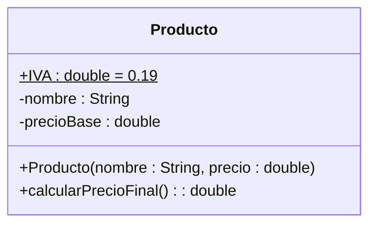

# Ejercicio 3: Clase Producto (Modelado de Atributos)

## 📝 Descripción
Se requiere modelar una clase `Producto` que represente un artículo en un inventario sencillo. La clase debe tener los atributos privados `nombre` (String) y `precioBase` (double). Debe contar con una **constante pública** `IVA` (double) con un valor fijo de `0.19`. El programa debe implementar un constructor para inicializar el nombre y el precio base, y un método público `calcularPrecioFinal() : double` que devuelva el precio base más el IVA.

> **Contexto Académico**: Este ejercicio introduce la representación de constantes y el cálculo de valores derivados a partir de los atributos de la clase en UML.

## 🎯 Objetivos de Aprendizaje
- Representación de constantes en UML (miembros estáticos y finales).
- Cálculo de valores derivados a partir de los atributos de clase.
- Uso de modificadores de acceso en el modelado UML.

## 📊 Diagrama UML (Mermaid)

---
🕓 **Dificultad**: Fácil
📚 **Temas**: Constantes, Atributos de clase, Métodos de cálculo.
