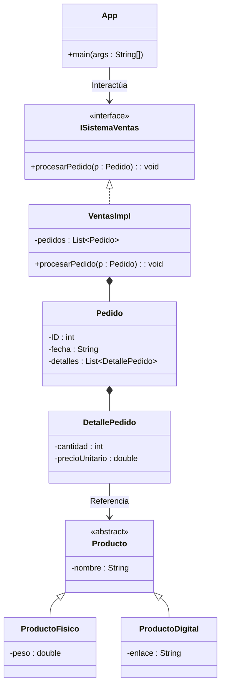

# Ejercicio Integrador: Sistema de Ventas (Modelado Completo)

## 📝 Descripción
Se requiere modelar un sistema de ventas profesional que integre los conceptos de arquitectura y modelado UML. El sistema debe seguir las siguientes reglas:
1. Una interfaz `ISistemaVentas` que define el método `procesarPedido(p : Pedido) : void`.
2. Una clase `VentasImpl` que realiza la interfaz `ISistemaVentas` y contiene una lista de `Pedidos`.
3. Un `Pedido` tiene los atributos `ID` (int) y `fecha` (String). 
4. Un `Pedido` **contiene** múltiples `DetallePedido` (composición). 
5. Cada `DetallePedido` está **asociado** a un `Producto`.
6. Existen dos tipos de productos: `ProductoFisico` (con atributo `peso`) y `ProductoDigital` (con atributo `enlaceDescarga`). Ambos hereden de la clase abstracta `Producto`.
7. Una clase `App` que tiene una asociación ("usa") con `ISistemaVentas`.

> **Contexto Académico**: Este es el reto culminante de UML. Requiere integrar todos los tipos de flechas y entidades (Interfaz, Clase Abstracta, Composición, Agregación y Herencia) en un modelo arquitectónico sólido y desacoplado.

## 🎯 Objetivos de Aprendizaje
- Integración completa de relaciones UML en un sistema de arquitectura multinivel.
- Aplicación de desacoplamiento mediante interfaces.
- Modelado de jerarquías de herencia y composición simultáneamente.
- Representación de una estructura de negocio compleja (Pedidos y Productos).

## 📊 Diagrama UML (Mermaid)

---
🕓 **Dificultad**: Integrador (Extrema)
📚 **Temas**: Interfaz, Herencia, Composición, Arquitectura, Multiplicidad.
