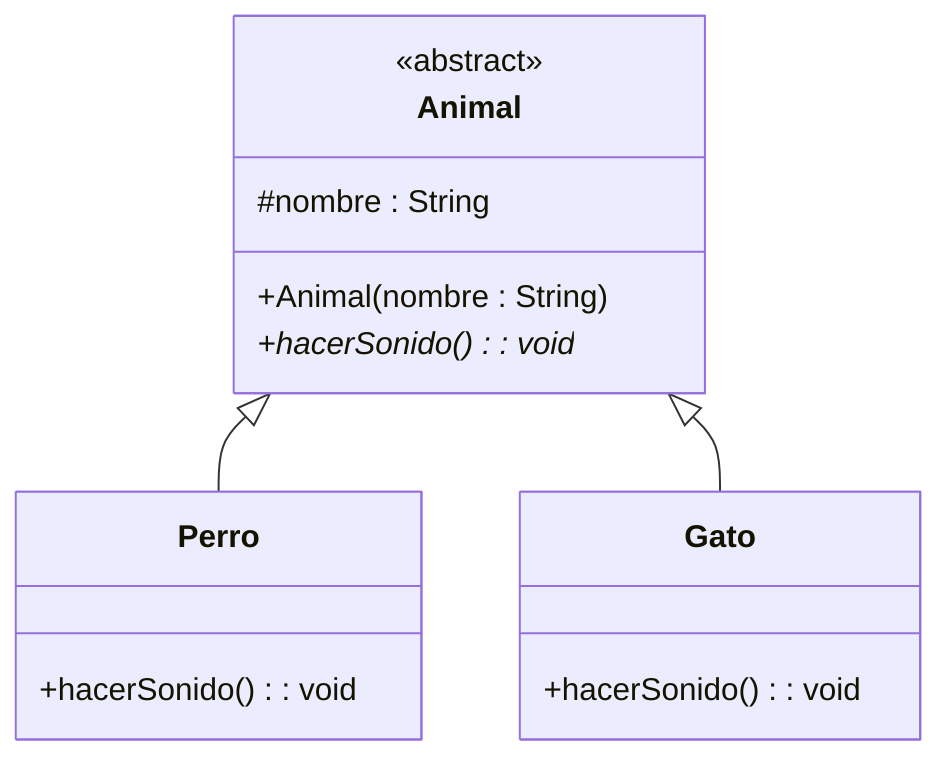

# Ejercicio 1: Modelado de Herencia (Generalización)

## 📝 Descripción
Se requiere modelar una jerarquía de clases para un sistema de animales. La superclase `Animal` debe ser **abstracta** y contener el atributo protegido `nombre` (String). Debe tener un constructor para inicializar el nombre y un método abstracto `hacerSonido() : void`. 

Posteriormente, se deben modelar dos subclases: `Perro` y `Gato`. Ambas deben heredar de `Animal` e implementar el método `hacerSonido()`.

> **Contexto Académico**: Este ejercicio refuerza el concepto de herencia en UML, el uso de clases abstractas y la visibilidad protegida (`#`). La flecha de herencia es una de las más fundamentales en el modelado orientado a objetos.

## 🎯 Objetivos de Aprendizaje
- Representación de clases abstractas y métodos abstractos en UML.
- Uso de la notación de visibilidad protegida (`#`).
- Modelado de la relación de herencia (flecha sólida con triángulo hueco).

## 📊 Diagrama UML (Mermaid)

---
🕓 **Dificultad**: Intermedio
📚 **Temas**: Herencia, Clases Abstractas, Visibilidad Protegida.
