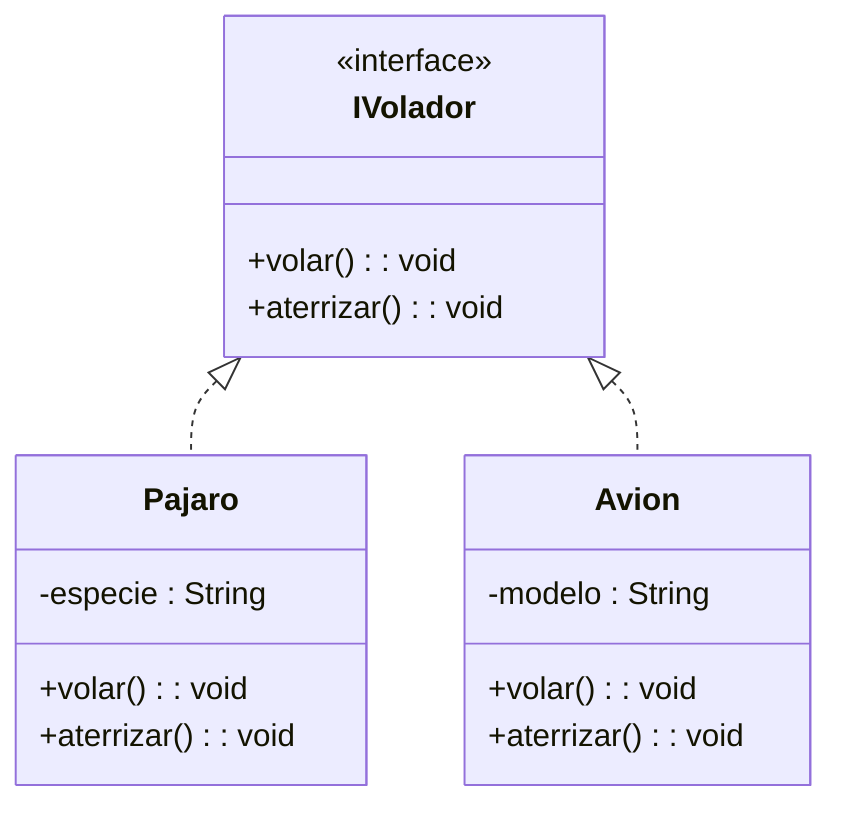

# Ejercicio 2: Modelado de Interfaces (Realización)

## 📝 Descripción
Se requiere modelar una interfaz `IVolador` que defina el comportamiento de los objetos que pueden volar en un simulador. La interfaz debe tener los métodos públicos `volar() : void` y `aterrizar() : void`. 

Posteriormente, modela dos clases: `Pajaro` y `Avion`. Ambas clases deben **realizar** (implementar) la interfaz `IVolador`. Además, la clase `Pajaro` tiene un atributo privado `especie` (String) y la clase `Avion` un atributo privado `modelo` (String).

> **Contexto Académico**: Este ejercicio introduce la relación de realización en UML, la cual se representa con una flecha discontinua y triángulo hueco. Las interfaces son fundamentales para definir contratos en el desarrollo orientado a objetos.

## 🎯 Objetivos de Aprendizaje
- Representación de interfaces (`<<interface>>`) en UML.
- Modelado de la relación de realización (flecha discontinua).
- Separación entre definición de comportamiento e implementación.

## 📊 Diagrama UML (Mermaid)

---
🕓 **Dificultad**: Intermedio
📚 **Temas**: Interfaces, Realización, Polimorfismo.
