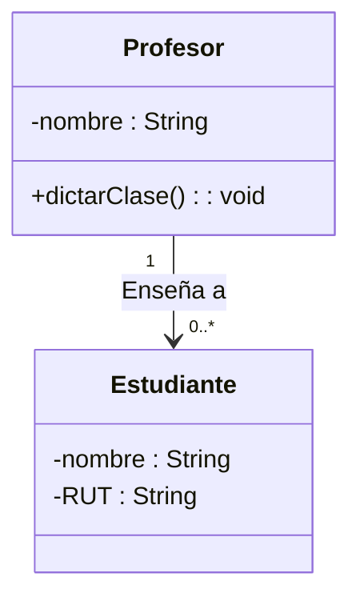

# Ejercicio 3: Modelado de Asociación y Multiplicidad

## 📝 Descripción
Se requiere modelar la relación entre un `Profesor` y sus `Estudiantes` en un sistema académico. Un `Profesor` tiene un atributo privado `nombre` (String) y un método para `dictarClase() : void`. Un `Estudiante` tiene los atributos privados `nombre` (String) y `RUT` (String).

Representa una **asociación** donde un `Profesor` puede tener a su cargo **muchos (0..*)** `Estudiantes`, pero un `Estudiante` pertenece a **un (1)** `Profesor` en el contexto de este ejercicio.

> **Contexto Académico**: Este ejercicio introduce la relación de asociación estructural y el concepto de multiplicidad en UML, permitiendo entender cómo las clases se conectan en un sistema real.

## 🎯 Objetivos de Aprendizaje
- Modelado de la relación de asociación (línea sólida).
- Definición de la multiplicidad (1, 0..*, etc.) en UML.
- Representación de listas de objetos en el modelo estructural.

## 📊 Diagrama UML (Mermaid)

---
🕓 **Dificultad**: Intermedio
📚 **Temas**: Asociación, Multiplicidad, Navegabilidad.
