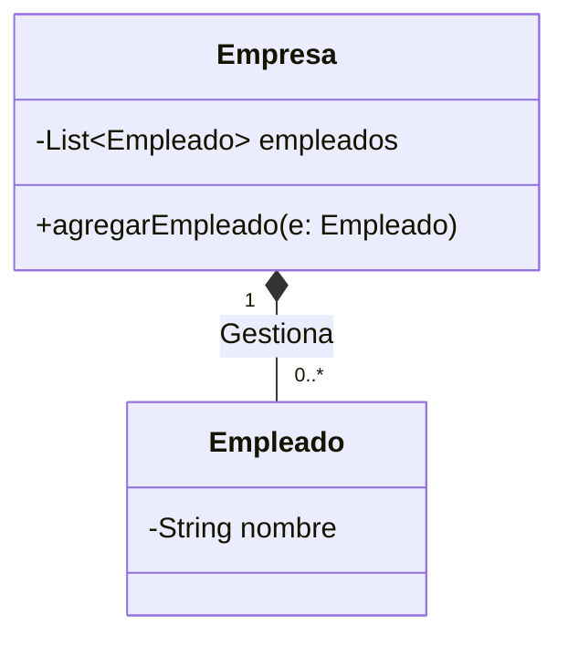

# Guía 04: Colecciones en Java

Las Colecciones son estructuras de datos dinámicas que permiten almacenar y manipular grupos de objetos. A diferencia de los arreglos (vectores), las colecciones pueden crecer o reducirse de tamaño automáticamente según sea necesario.

---

## 1. Arreglos vs. Colecciones
| Característica | Arreglos (Vectores/Matrices) | Colecciones (List, Set, Map) |
| :--- | :--- | :--- |
| **Tamaño** | Estático (Fijo al inicio). | Dinámico (Crece automáticamente). |
| **Tipo de dato** | Primitivos y Objetos. | Solo Objetos (Usa *Wrapper classes*). |
| **Flexibilidad** | Limitada. | Alta (Búsqueda, ordenamiento, filtrado). |

---

## 2. La Interfaz `List` y `ArrayList`
La colección más utilizada y **permitida** es `ArrayList`. Representa una lista ordenada que permite elementos duplicados y acceso rápido por índice.

### Wrapper Classes
Como las colecciones solo guardan objetos, Java convierte automáticamente los primitivos a sus clases equivalentes (**Autoboxing**):
- `int` -> `Integer`
- `double` -> `Double`

### Operaciones Fundamentales
```java
import java.util.ArrayList;
import java.util.List;

public class EjemploColecciones {
    public static void main(String[] args) {
        // Declaración (Usando polimorfismo: Interfaz a la izquierda)
        List<String> nombres = new ArrayList<>();

        // 1. Agregar elementos
        nombres.add("Ana");
        nombres.add("Pedro");

        // 2. Obtener tamaño
        int total = nombres.size();

        // 3. Acceder por índice
        String primero = nombres.get(0);

        // 4. Eliminar
        nombres.remove("Pedro");
    }
}
```

---

## 3. Recorrido de Colecciones
Existen varias formas de procesar los elementos de una colección:

### A. Ciclo For-Each (Recomendado)
Es la forma más limpia y legible de recorrer una lista.

```java
for (String nombre : nombres) {
    System.out.println("Nombre: " + nombre);
}
```

### B. Ciclo For Tradicional
Útil si necesitamos conocer la posición exacta (`i`) de cada elemento.

```java
for (int i = 0; i < nombres.size(); i++) {
    System.out.println("Índice " + i + ": " + nombres.get(i));
}
```

---

## 4. Ordenamiento de Colecciones `[⚠️ NO PERMITIDO]`
En contextos académicos, se suele exigir que el alumno implemente sus propios algoritmos de ordenamiento (como BubbleSort) sobre arreglos. El uso de herramientas automáticas suele estar restringido.

```java
import java.util.Collections;

// [⚠️ NO PERMITIDO EN EVALUACIONES]
Collections.sort(nombres); 
```

---

## 5. El Mapa (`Map` y `HashMap`) `[⚠️ NO PERMITIDO]`
Aunque son estructuras potentes para almacenar pares Clave-Valor, su uso suele estar **prohibido** en los cursos iniciales de POO para fomentar el uso de listas y búsquedas manuales.

```java
import java.util.HashMap;
import java.util.Map;

// [⚠️ NO PERMITIDO EN EVALUACIONES]
Map<String, Double> precios = new HashMap<>();
precios.put("Pan", 1200.0);
```

---

## 6. Diagrama de Relación (UML)
Las colecciones se representan en UML como una relación de "uno a muchos" utilizando la composición o agregación.



---

**Nota Académica**: Si el enunciado no permite el uso de `Collections.sort()`, recuerda utilizar el algoritmo de **BubbleSort** que vimos en la Guía 01 sobre un arreglo convencional.
