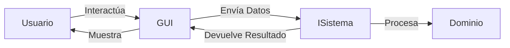

# Guía 08: Graphical User Interface (GUI) con Java Swing

Java Swing es la biblioteca estándar para crear interfaces gráficas de usuario (GUI) en Java. Se basa en un modelo de **Componentes** y **Contenedores**, y utiliza un sistema de **Eventos** para interactuar con el usuario.

---

## 1. Contenedores vs. Componentes
Para construir una GUI, debemos entender la jerarquía de elementos:

1.  **Contenedores de Alto Nivel**: Son las ventanas principales. El más común es `JFrame`.
2.  **Contenedores Intermedios**: Se usan para organizar grupos de componentes. El más común es `JPanel`.
3.  **Componentes Atómicos**: Elementos individuales de interacción como `JButton` (Botón), `JLabel` (Texto), `JTextField` (Campo de texto) y `JComboBox` (Lista desplegable).

---

## 2. Layout Managers (Gestores de Diseño)
En Swing, no solemos posicionar los elementos por coordenadas exactas (x, y), sino que usamos **Layout Managers** para que la interfaz sea responsiva.

- **`BorderLayout`**: Divide el contenedor en 5 zonas (North, South, East, West, Center). Es el diseño por defecto de `JFrame`.
- **`FlowLayout`**: Coloca los elementos uno tras otro en una línea.
- **`GridLayout`**: Organiza los elementos en una cuadrícula de filas y columnas uniformes.

---

## 3. Estructura Básica de una Ventana
```java
import javax.swing.*;
import java.awt.*;

/**
 * Representa la ventana principal de la aplicación.
 */
public class VentanaPrincipal extends JFrame {

    public VentanaPrincipal() {
        // Configuraciones básicas
        setTitle("Mi Aplicación POO");
        setSize(400, 300);
        setDefaultCloseOperation(JFrame.EXIT_ON_CLOSE); // Cierra el proceso al cerrar ventana
        setLocationRelativeTo(null); // Centra la ventana en la pantalla

        // Configuración del contenido
        setLayout(new BorderLayout());
        
        JLabel etiqueta = new JLabel("Bienvenido al sistema", SwingConstants.CENTER);
        JButton boton = new JButton("Click aquí");

        add(etiqueta, BorderLayout.CENTER);
        add(boton, BorderLayout.SOUTH);
    }

    public void iniciar() {
        setVisible(true); // Hace la ventana visible
    }
}
```

---

## 4. Manejo de Eventos (`ActionListener`)
Para que un botón "haga algo", debemos registrar un **Escuchador de Eventos**.

```java
/**
 * Ejemplo de cómo asignar acción a un botón.
 */
boton.addActionListener(e -> {
    System.out.println("Botón presionado");
    JOptionPane.showMessageDialog(this, "¡Hola desde Swing!");
});
```

---

## 5. Arquitectura GUI: Separación de Responsabilidades
Un error académico grave es escribir la lógica del negocio dentro del código de la GUI. La GUI debe ser únicamente una **Capa de Presentación**.

### Estándar de Comunicación
1.  La **GUI** captura los datos (ej. desde un `JTextField`).
2.  La **GUI** llama a un método de la **Interfaz del Sistema** (`ISistema`).
3.  El **Sistema** procesa la información y devuelve un resultado.
4.  La **GUI** muestra el resultado al usuario.



---

## 6. Componentes de Interacción Avanzados

Para construir interfaces más ricas, Swing ofrece componentes especializados para diferentes tipos de entrada de datos.

### A. JComboBox (Lista Desplegable)
Permite al usuario seleccionar una opción de una lista predefinida.

```java
String[] opciones = {"Lunes", "Martes", "Miércoles"};
JComboBox<String> combo = new JComboBox<>(opciones);

// Obtener el elemento seleccionado
String seleccionado = (String) combo.getSelectedItem();
```

### B. JRadioButton y ButtonGroup (Selección Única)
Se usan cuando el usuario debe elegir **solo una** opción entre varias. Es fundamental agruparlos en un `ButtonGroup`.

```java
JRadioButton opcion1 = new JRadioButton("Crédito");
JRadioButton opcion2 = new JRadioButton("Débito");

ButtonGroup grupo = new ButtonGroup();
grupo.add(opcion1);
grupo.add(opcion2);

// Verificar cuál está seleccionado
if (opcion1.isSelected()) { /* Lógica crédito */ }
```

### C. JCheckBox (Selección Múltiple)
Permite seleccionar una o más opciones independientes.

```java
JCheckBox check1 = new JCheckBox("Acepto términos");
JCheckBox check2 = new JCheckBox("Suscribirse al boletín");

if (check1.isSelected()) { /* El usuario aceptó */ }
```

### D. JScrollPane (Barras de Desplazamiento)
Es un contenedor especial que añade barras de desplazamiento a componentes que pueden crecer mucho.

```java
JTextArea areaTexto = new JTextArea(10, 30);
JScrollPane scroll = new JScrollPane(areaTexto);

// Agregamos el scroll al panel, NO el areaTexto directamente
panel.add(scroll);
```

### E. JMenuBar, JMenu y JMenuItem (Menús Superiores)
Permiten organizar acciones en la parte superior de la ventana.

```java
JMenuBar barraMenu = new JMenuBar();
JMenu menuArchivo = new JMenu("Archivo");
JMenuItem itemSalir = new JMenuItem("Salir");

menuArchivo.add(itemSalir);
barraMenu.add(menuArchivo);

this.setJMenuBar(barraMenu); // Se asigna directamente al JFrame
```

---

## 8. Caso Práctico: Ventana de Login
A continuación, se presenta un ejemplo de una ventana de acceso que integra etiquetas, campos de texto, campos de contraseña y un botón de acción.

```java
import javax.swing.*;
import java.awt.*;

/**
 * Ventana de Login que sigue el estándar de desacoplamiento.
 */
public class VentanaLogin extends JFrame {
    private JTextField txtUsuario;
    private JPasswordField txtPassword;
    private JButton btnIngresar;
    private ISistema sistema; // Referencia a la lógica de negocio

    public VentanaLogin(ISistema sistema) {
        this.sistema = sistema;
        
        setTitle("Acceso al Sistema");
        setSize(300, 150);
        setDefaultCloseOperation(JFrame.EXIT_ON_CLOSE);
        setLocationRelativeTo(null);
        
        configurarComponentes();
    }

    private void configurarComponentes() {
        // Panel con rejilla de 3 filas y 2 columnas
        JPanel panel = new JPanel(new GridLayout(3, 2, 5, 5));
        panel.setBorder(BorderFactory.createEmptyBorder(10, 10, 10, 10));

        txtUsuario = new JTextField();
        txtPassword = new JPasswordField();
        btnIngresar = new JButton("Ingresar");

        panel.add(new JLabel("Usuario:"));
        panel.add(txtUsuario);
        panel.add(new JLabel("Contraseña:"));
        panel.add(txtPassword);
        panel.add(new JLabel("")); 
        panel.add(btnIngresar);

        add(panel);

        // Acción del botón
        btnIngresar.addActionListener(e -> {
            String user = txtUsuario.getText();
            String pass = new String(txtPassword.getPassword());
            
            // Delegación de la lógica al sistema
            if (sistema.validarAcceso(user, pass)) {
                JOptionPane.showMessageDialog(this, "Bienvenido");
            } else {
                JOptionPane.showMessageDialog(this, "Error de acceso", "Error", JOptionPane.ERROR_MESSAGE);
            }
        });
    }
}
```

---

## 9. Tabla Resumen de Componentes

| Componente | Propósito | Evento Principal |
| :--- | :--- | :--- |
| **`JButton`** | Ejecutar una acción o comando. | `ActionListener` |
| **`JTextField`** | Entrada de texto de una sola línea. | `ActionListener` (Enter) |
| **`JPasswordField`** | Entrada de contraseña segura (oculta). | `ActionListener` |
| **`JTextArea`** | Entrada/Salida de múltiples líneas de texto. | `DocumentListener` |
| **`JLabel`** | Mostrar texto informativo o imágenes. | `N/A` |
| **`JCheckBox`** | Selección múltiple de opciones. | `ItemListener` |
| **`JRadioButton`** | Selección única (usar con `ButtonGroup`). | `ItemListener` |
| **`JComboBox`** | Selección desde una lista desplegable. | `ActionListener` |
| **`JTable`** | Mostrar y editar datos tabulares. | `TableModelListener` |
| **`JScrollPane`** | Añadir barras de desplazamiento a otros componentes. | `AdjustmentListener` |

---

**Nota Académica Final**: Al desarrollar ejercicios con GUI, asegúrate de que tu clase `Ventana` sea independiente. Nunca instancies la lógica pesada (como lectura de archivos) directamente en el constructor de la ventana; pásala como una referencia de interfaz (`ISistema`) para mantener el desacoplamiento. Esto facilitará enormemente las pruebas y el mantenimiento del sistema.
