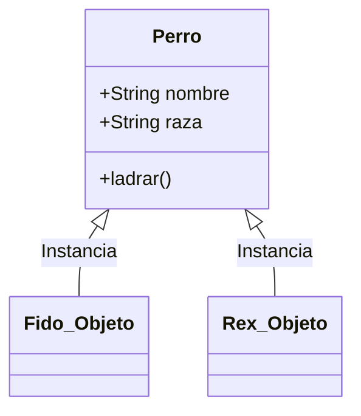
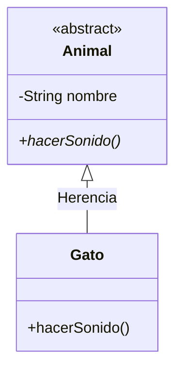

# Guía 03: Programación Orientada a Objetos (POO)

La POO es un paradigma de programación que utiliza "objetos" para representar datos y comportamientos. Su objetivo es organizar el código de manera que sea reutilizable, escalable y fácil de mantener.

---

## 1. Clase vs. Objeto
Para entender la POO, debemos distinguir entre el "plano" y la "construcción".

- **Clase**: Es el molde o plantilla. Define qué atributos y métodos tendrá un objeto. No ocupa espacio real en memoria para datos.
- **Objeto**: Es la **instancia** de una clase. Es el elemento real que vive en la memoria y contiene valores específicos.



---

## 2. Atributos y Métodos
- **Atributos (Estado)**: Variables que definen las características del objeto.
- **Métodos (Comportamiento)**: Funciones que definen qué puede hacer el objeto.

---

## 3. El Constructor
Es un método especial que se ejecuta automáticamente al crear un objeto (`new`). Su función principal es **inicializar el estado** del objeto.

- Si no defines uno, Java crea un "Constructor por Defecto" (vacío).
- El nombre del constructor debe ser **idéntico** al de la clase.

```java
public class Persona {
    private String nombre;

    /**
     * Constructor de la clase Persona.
     * @param nombre El nombre inicial de la persona.
     */
    public Persona(String nombre) {
        this.nombre = nombre; // 'this' diferencia el atributo del parámetro
    }
}
```

---

## 4. Los 4 Pilares de la POO

### A. Abstracción
Consiste en capturar solo las características esenciales de un objeto para el contexto del problema, ignorando los detalles irrelevantes.
- **Herramientas**: Clases abstractas e Interfaces.

### B. Encapsulamiento
Protege los datos internos de un objeto contra el acceso no autorizado o accidental.
- **Regla de Oro**: Atributos `private` y acceso mediante métodos `public` (**Getters y Setters**).

### C. Herencia
Permite que una clase (subclase) adquiera los atributos y métodos de otra (superclase).
- **Palabra clave**: `extends`.
- **Ventaja**: Fomenta la reutilización de código.

### D. Polimorfismo
Es la capacidad de un objeto de tomar múltiples formas. Un objeto de una subclase puede ser tratado como si fuera de su superclase.
- **Sobrescritura (`@Override`)**: Una subclase redefine un método de su padre para adaptarlo a su propia lógica.

---

## 5. Ejemplo Integrado: Los Pilares en Acción



### Código Java (Enfoque Académico)
```java
/**
 * Clase abstracta que representa el concepto general de Animal.
 * Aplica ABSTRACCIÓN al no permitir instanciar "un animal" genérico.
 */
public abstract class Animal {
    // ENCAPSULAMIENTO: Atributo privado
    private String nombre;

    public Animal(String nombre) {
        this.nombre = nombre;
    }

    /**
     * Método abstracto que obliga a las subclases a definir su sonido.
     */
    public abstract void hacerSonido();

    public String getNombre() { return nombre; }
}

/**
 * Clase Gato que hereda de Animal.
 */
public class Gato extends Animal {
    public Gato(String nombre) {
        super(nombre); // Llama al constructor del padre
    }

    /**
     * POLIMORFISMO: El gato redefine el sonido de manera específica.
     */
    @Override
    public void hacerSonido() {
        System.out.println("Miau");
    }
}
```

---

**Nota Académica**: La POO no se trata de escribir más código, sino de modelar la realidad. Un buen diseño POO utiliza el **Encapsulamiento** para la seguridad, la **Herencia** para la estructura y el **Polimorfismo** para la flexibilidad.
