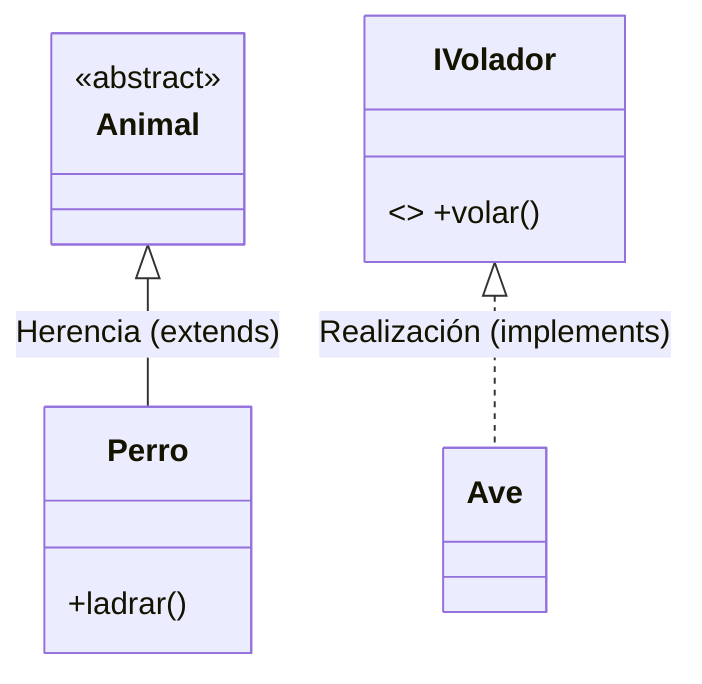
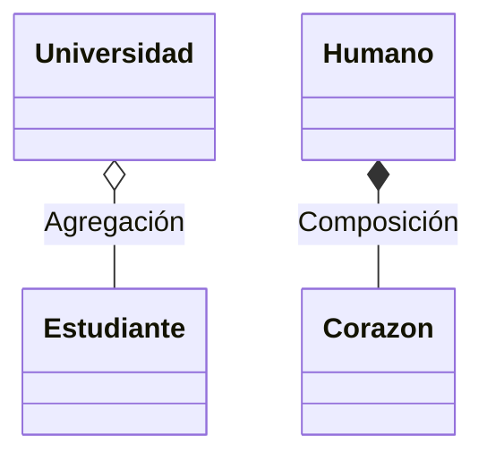
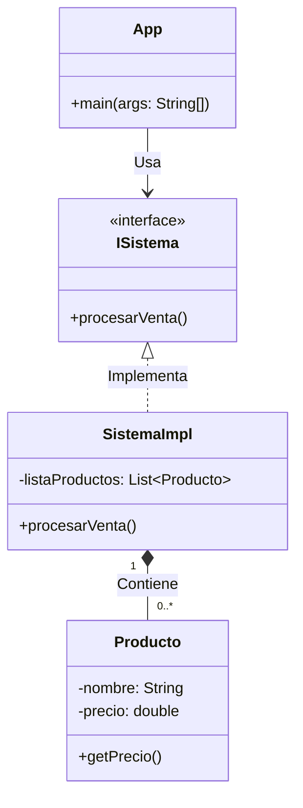

# Guía 02: UML (Unified Modeling Language)

El UML es el estándar visual para el diseño de sistemas. En esta guía, exploraremos cómo modelar el **Dominio** de un problema y cómo representar las diferentes entidades y sus relaciones.

---

## 1. El Modelo de Dominio
El **Modelo de Dominio** es una representación visual de las clases conceptuales o objetos del mundo real en un sistema. 

- **Propósito**: Capturar los conceptos más importantes y las reglas de negocio.
- **Enfoque**: No se centra en la implementación técnica (como bases de datos), sino en cómo interactúan los elementos del problema (ej. un `Estudiante`, un `Curso` y una `Inscripción`).

---

## 2. Entidades en un Diagrama de Clases
En un desarrollo académico y profesional, solemos separar las responsabilidades en diferentes tipos de entidades:

| Entidad | Representación UML | Propósito en Java |
| :--- | :--- | :--- |
| **Clase** | Rectángulo sólido | Define el estado (atributos) y comportamiento (métodos). |
| **Interfaz** | `<<interface>>` | Define un contrato o comportamiento que otras clases deben cumplir. |
| **App / Lógica** | Clase con `main` | Clase controladora que inicia la ejecución y coordina los objetos. |

---

## 3. Notación de Flechas y Relaciones
Las flechas en UML no son decorativas; cada una tiene un significado técnico específico que se traduce a una línea de código en Java.

### A. Herencia y Realización
- **Herencia (Sólida + Triángulo hueco)**: "Es un". Una subclase hereda de una superclase.
- **Realización (Discontinua + Triángulo hueco)**: "Cumple con". Una clase implementa una interfaz.



### B. Asociación, Agregación y Composición
Representan cómo un objeto "tiene" o "conoce" a otro.

- **Asociación (Línea simple)**: Una relación estructural. Un `Medico` conoce a un `Paciente`.
- **Agregación (Diamante hueco)**: Relación débil. El "todo" y las "partes" pueden existir independientemente (ej. `Aula` y `Estudiante`).
- **Composición (Diamante relleno)**: Relación fuerte. La "parte" no tiene sentido sin el "todo" (ej. `Libro` y `Pagina`).



---

## 4. Ejemplo de Modelo de Dominio Integrado
A continuación, se presenta un modelo de un sistema de ventas sencillo representado en Mermaid.



### Traducción a Código (Enfoque Académico)
```java
/**
 * Interfaz que define el contrato del sistema.
 */
public interface ISistema {
    void procesamientoVenta();
}

/**
 * Implementación del sistema que gestiona productos.
 */
public class SistemaImpl implements ISistema {
    // Relación de Composición/Agregación: El sistema tiene productos
    private List<Producto> listaProductos;

    @Override
    public void procesarVenta() {
        // Lógica de negocio
    }
}
```

---

**Nota Académica**: Al diseñar, siempre comienza por el **Modelo de Dominio**. Identifica los sustantivos (clases) y los verbos (métodos). La clase `App` o `Main` debe ser lo más delgada posible, delegando la lógica a las clases del dominio.
